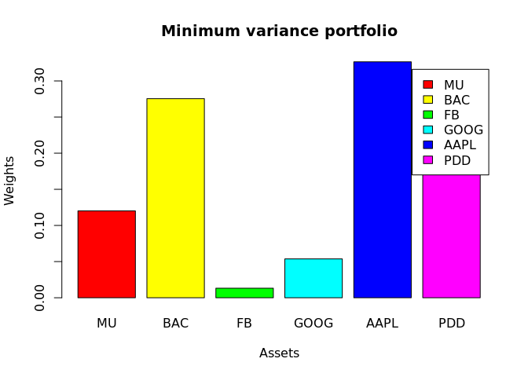
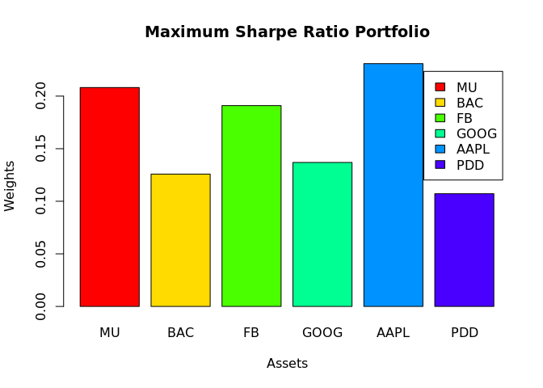

<!-- README.md is generated from README.Rmd. Please edit that file -->

# Investment-Portfolio

<!-- badges: start -->
<!-- badges: end -->

The goal of Investment-Portfolio is to …

------------------------------------------------------------------------

## Stock selection and visualitazion of data

What is special about using `README.Rmd` instead of just `README.md`?
You can include R chunks like so:

The following is a list of the stocks used for the analysis of the
portfolio with the respective weights of each stock, it should be noted
that the following portfolio to be analyzed is not personal, it was
taken from an investor of the following website <http://dataroma.com/>.

| **Assets** | **Weight** |
|------------|------------|
| MU         | 47.52%     |
| BAC        | 20.63%     |
| FB         | 14.45%     |
| GOOG       | 8.29%      |
| APPL       | 5.55%      |
| PDD        | 3.55%      |

First, let’s look at the historical prices of each stock as of 2014 in a
table with tibble format, which is very useful for working with
financial data.

    #> # A tibble: 13,494 x 8
    #>    symbol date        open  high   low close   volume adjusted
    #>    <chr>  <date>     <dbl> <dbl> <dbl> <dbl>    <dbl>    <dbl>
    #>  1 MU     2011-01-03  8.14  8.48  8.14  8.28 43343100     8.28
    #>  2 MU     2011-01-04  8.38  8.58  8.36  8.44 44645900     8.44
    #>  3 MU     2011-01-05  8.41  8.78  8.4   8.54 38533500     8.54
    #>  4 MU     2011-01-06  8.67  8.7   8.55  8.58 25273800     8.58
    #>  5 MU     2011-01-07  8.56  8.7   8.45  8.65 24517000     8.65
    #>  6 MU     2011-01-10  8.68  8.68  8.39  8.55 30493200     8.55
    #>  7 MU     2011-01-11  8.62  8.73  8.48  8.72 27511400     8.72
    #>  8 MU     2011-01-12  8.85  9.5   8.84  9.34 92085800     9.34
    #>  9 MU     2011-01-13  9.79  9.87  9.58  9.63 75174700     9.63
    #> 10 MU     2011-01-14  9.73  9.86  9.65  9.71 40679500     9.71
    #> # … with 13,484 more rows

------------------------------------------------------------------------

## Individual returns and cumulative returns

We will calculate the individual returns per asset.

    #> # A tibble: 13,494 x 5
    #> # Groups:   symbol [6]
    #>    symbol date            Ret   wts wt_return
    #>    <chr>  <date>        <dbl> <dbl>     <dbl>
    #>  1 MU     2011-01-03  0       0.475   0      
    #>  2 MU     2011-01-04  0.0193  0.475   0.00918
    #>  3 MU     2011-01-05  0.0118  0.475   0.00563
    #>  4 MU     2011-01-06  0.00468 0.475   0.00223
    #>  5 MU     2011-01-07  0.00816 0.475   0.00388
    #>  6 MU     2011-01-10 -0.0116  0.475  -0.00549
    #>  7 MU     2011-01-11  0.0199  0.475   0.00945
    #>  8 MU     2011-01-12  0.0711  0.475   0.0338 
    #>  9 MU     2011-01-13  0.0310  0.475   0.0148 
    #> 10 MU     2011-01-14  0.00831 0.475   0.00395
    #> # … with 13,484 more rows

We will work with the accumulated returns per asset, in this case 6
assets, the table of the accumulated returns for the 6 assets that were
initially chosen is as follows.

    #> # A tibble: 2,624 x 3
    #>    date       port_ret    cr
    #>    <date>        <dbl> <dbl>
    #>  1 2011-01-03  0        1   
    #>  2 2011-01-04  0.00989  1.01
    #>  3 2011-01-05  0.0108   1.02
    #>  4 2011-01-06  0.00193  1.02
    #>  5 2011-01-07  0.00195  1.02
    #>  6 2011-01-10 -0.00258  1.02
    #>  7 2011-01-11  0.0137   1.04
    #>  8 2011-01-12  0.0386   1.08
    #>  9 2011-01-13  0.0119   1.09
    #> 10 2011-01-14  0.0121   1.10
    #> # … with 2,614 more rows

If we plot cumulative return vs. date, we obtain the following graph,
which is more descriptive.

<!-- -->

------------------------------------------------------------------------

## Some important Statistics

Calculating the average annualized returns and the average annualized
returns excluding 2020 we obtain:

    #> [1] "The average annual portfolio returns is 26.08%"
    #> [[1]]
    #> [1] "The average annual portfolio returns until 2019-12-31 is 23.41%"

Now, We going to calculate the Standard deviation or the volatility of
the portfolio.

    #> [1] "The daily portfolio volatility is  0.0195"
    #> [[1]]
    #> [1] "The daily portfolio volatility until  2019-12-31  is  0.0182"

Calculating the annual volatility of the portfolio, we obtain:

    #> [1] "The annual portfolio volatility is  0.309228551476367"
    #> [1] "The annual portfolio volatility until 2019-12-31 is  0.289326999817226"

The sharpe ratio is a measure of the excess return per unit of risk of
an investment, it is used to show to what extent the return on an
investment compensates the investor for taking risk in his investment,
so it is good to calculate it.

    #> [1] "The annual portfolio sharpe ratio is 0.8433"

------------------------------------------------------------------------

## Find the Portfolio optimization

To find the most optimal portfolio we will make a loop where for each
iteration we will calculate random weights, we will calculate the return
for the given stocks with those weights, the standard deviation of each
of the virtual portfolios as well as the sharp ratio of each portfolio,
at the end, we will identify the portfolio with minimum variance and
maximum sharp ratio, in our case, we obtain the following after 5,000
iterations:

-   Minimum variance portfolio:

<!-- -->

    #> # A tibble: 1 x 9
    #>      MU   BAC    FB  GOOG   AAPL   PDD   Return   Risk SharpeRatio
    #>   <dbl> <dbl> <dbl> <dbl>  <dbl> <dbl>    <dbl>  <dbl>       <dbl>
    #> 1 0.173 0.213 0.114 0.285 0.0808 0.134 0.000743 0.0132      0.0562

-   Maximum Sharpe Ratio Portfolio

<!-- -->

    #> # A tibble: 1 x 9
    #>      MU   BAC    FB   GOOG  AAPL   PDD   Return   Risk SharpeRatio
    #>   <dbl> <dbl> <dbl>  <dbl> <dbl> <dbl>    <dbl>  <dbl>       <dbl>
    #> 1 0.101 0.221 0.155 0.0641 0.184 0.274 0.000836 0.0138      0.0605

Finally, let’s visualize in a bar chart, the minimum variance portfolio
for each asset, as well as the maximum sharpe ratio portfolio for each
asset.

<!-- --><!-- -->

We can observe and mention some conclusions about the bar charts that
for the stock “BAC” has a lot of weight in both bar charts, so we can
conclude that, according to our investment portfolio, it is wise to give
a lot of weight to this asset.
